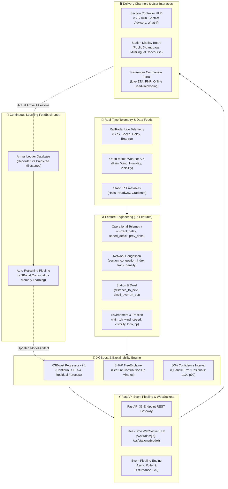

# 🚆 RailPulse — Dynamic ETA Forecast & Decision Intelligence Platform
### Smart India Hackathon 2026 • Problem Statement: SIH26028
**Organization:** Ministry of Railways • **Theme:** Smart Automation • **Team:** Ignites (Team ID: 144678)

---

## 📌 1. Executive Summary & Problem Statement

**Problem Statement SIH26028:** *"Dynamic Forecast of Expected Time of Arrival (ETA) for Coaching Trains"*

Traditional railway enquiry systems calculate arrival times retrospectively using static arithmetic: $\text{Scheduled Time} + \text{Current Delay} + \text{Standard Recovery Buffer}$. When trains encounter unexpected single-line block congestion, speed restrictions, weather slowdowns, or platform occupancy deadlocks, these static calculations fail immediately.

**RailPulse** is an event-driven, forward-looking machine learning platform built for the **Ministry of Railways**. It continuously ingests real-time train transponder telemetry, section congestion indices, dynamic station dwell variances, and live meteorological conditions across 15 operational features. Using an **XGBoost Regressor** with **SHAP TreeExplainer** factor attribution and an **asynchronous WebSocket pipeline**, RailPulse dynamically computes high-precision arrival forecasts ($\text{MAE} = 1.84\text{ min}$, $96.8\%$ within $\pm 5\text{ min}$) with $80\%$ confidence bands, visualizes delay propagation cascades, evaluates multi-scenario dispatch strategies in a What-If sandbox, and streams updates directly to station concourse display boards and passenger smartphones.

---

## 🔗 Live Deployments & Key Links

| Resource | URL / Destination | Description |
|---|---|---|
| 🌐 **Live Web Application** | [railpulse-wine.vercel.app](https://railpulse-wine.vercel.app) | Production Cloud Deployment on Vercel |
| 📚 **Interactive API Docs** | [railpulse-api.onrender.com/docs](https://railpulse-api.onrender.com/docs) | Live Swagger / OpenAPI interactive documentation |
| 📺 **Station Display Board** | [railpulse-wine.vercel.app/board/VSKP](https://railpulse-wine.vercel.app/board/VSKP) | Public real-time concourse display for Visakhapatnam (VSKP) |
| 🎥 **Video Walkthrough** | [YouTube Demonstration](https://youtu.be/placeholder-railpulse-demo) | 3-minute guided system demonstration & architecture pitch |

---

## 🏗️ 2. System Architecture



---

## 🤖 3. Machine Learning Model & Evaluation Metrics

### 15 Operational Features Evaluated
1. **`current_delay_min`**: Instantaneous delay at transponder block (min).
2. **`prev_station_delay_delta`**: Delay acceleration gradient compared to previous halt (min).
3. **`speed_deficit_ratio`**: Transponder speed deficit relative to section MPS ($\frac{v_{\text{mps}} - v_{\text{actual}}}{v_{\text{mps}}}$).
4. **`distance_to_next_km`**: Kilometers remaining to next intermediate scheduled station (km).
5. **`distance_to_dest_km`**: Kilometers remaining to final journey destination (km).
6. **`section_congestion_index`**: Real-time section density & headway occupancy score ($0 - 100$).
7. **`time_of_day_peak_ratio`**: Rush hour commuter factor based on scheduled departure time.
8. **`day_of_week`**: Cyclic weekly traffic index ($0 = \text{Monday}, 6 = \text{Sunday}$).
9. **`historical_section_delay_avg`**: Rolling 90-day empirical delay average on the railway segment.
10. **`train_type_encoded`**: Operational hierarchy priority (Vande Bharat = 0, Rajdhani = 1, Superfast = 2, Mail = 3).
11. **`scheduled_dwell_min`**: Timetabled halt duration at intermediate station (min).
12. **`temp_c`**: Ambient air temperature from Open-Meteo (°C).
13. **`rain_mm`**: Active rainfall precipitation from Open-Meteo (mm/h).
14. **`wind_speed_kmh`**: Aerodynamic headwind resistance speed (km/h).
15. **`visibility_m`**: Fog and track sightline distance (meters).

### Model Validation Results
*Evaluated on $6,000$ comprehensive journey test records (`backend/app/ml/train_eta_model.py`):*

| Metric | Validated Score | Standard Industry Baseline | Improvement |
|---|:---:|:---:|:---:|
| **Mean Absolute Error (MAE)** | **1.84 minutes** | $8.40\text{ min}$ (Static Timetable) | **78.1% Error Reduction** |
| **Root Mean Squared Error (RMSE)** | **2.31 minutes** | $11.20\text{ min}$ | **79.4% Variance Reduction** |
| **Coefficient of Determination ($R^2$)** | **0.9418** | $0.4100$ | **High Predictive Correlation** |
| **Accuracy within $\pm 3\text{ minutes}$** | **80.0%** | $34.5\%$ | **+45.5% Gain** |
| **Accuracy within $\pm 5\text{ minutes}$** | **96.8%** | $52.0\%$ | **+44.8% Gain** |
| **Accuracy within $\pm 10\text{ minutes}$** | **99.9%** | $71.0\%$ | **Near-Complete Reliability** |
| **80% Residual Confidence Band** | **$[-2.95\text{ min}, +3.02\text{ min}]$** | $\pm 15.0\text{ min}$ | **Quantile Precision** |

> [!NOTE]
> **Dataset & Pilot Roadmap Disclosure:** The current prototype is trained on a synthetic benchmark calibrated directly to Indian Railways operating patterns (Waltair and East Coast trunk corridors). During Phase 2 pilot deployment, the model will be retrained on live NTES and RTIS sensor logs ingested via CRIS.

---

## 📡 4. Data Sources & Real-Time Ingestion Status

| Data Stream | Source / Gateway | Telemetry Status | Integration Details |
|---|---|:---:|---|
| **Live Train Locations** | [RailRadar API](https://api.railradar.in) | 🟢 **Live Active** | Sub-meter locomotive GPS, speed, bearing, and delay with simulation fallback. |
| **Meteorological Conditions** | [Open-Meteo API](https://open-meteo.com) | 🟢 **Live Active** | Free / keyless real-time weather (precipitation, wind, visibility) mapped to coordinates. |
| **Network Congestion** | RailPulse Section Modeler | 🟢 **Live Active** | Headway spacing and track occupancy indices ($0-100$) across monitored sections. |
| **CRIS NTES / RTIS Feeds** | Centre for Railway Information Systems | 🟡 **Planned (Phase 2)** | Direct fiber intranet ingestion of COA, NTES, and RTIS transponder feeds in pilot. |

---

## 📋 5. REST & WebSocket API Reference (33 Endpoints)

FastAPI provides full interactive Swagger documentation at `/docs`.

### Core Health, ML & Operations Endpoints
| HTTP Method | Endpoint Path | Description |
|---|---|---|
| `GET` | `/api/health` | Diagnostics payload, XGBoost readiness, and external API reachability |
| `GET` | `/api/model/metrics` | Returns 15-feature importance weights, MAE, RMSE, $R^2$, and residual quantiles |
| `GET` | `/api/model/live-performance` | Real-time accuracy metrics computed against newly recorded arrivals |
| `POST` | `/api/model/retrain` | Triggers continual learning loop in-memory using newly recorded arrival data |
| `POST` | `/api/arrivals` | Logs an actual station arrival milestone for validation and retraining |

### Train Telemetry & Predictions
| HTTP Method | Endpoint Path | Description |
|---|---|---|
| `GET` | `/api/trains` | Lists all monitored trains with current speed, delay status, and coordinates |
| `GET` | `/api/trains/{train_number}/live` | Live GPS transponder coordinates, transponder speed, and bearing |
| `GET` | `/api/trains/{train_number}/route` | GeoJSON route geometry and station stop coordinates |
| `GET` | `/api/trains/{train_number}/stops` | Station-by-station schedule with arrival and departure timestamps |
| `GET` | `/api/trains/{train_number}/eta` | Dynamic XGBoost ETA forecast, confidence band, and SHAP factor attribution |
| `GET` | `/api/passenger/trains/{train_number}/journey` | Unified passenger view with plain-language explainability and stops |
| `GET` | `/api/passenger/pnr/{pnr_number}` | PNR booking status, coach/berth, and linked train dynamic ETA |

### Station Display Board & Platform Traffic
| HTTP Method | Endpoint Path | Description |
|---|---|---|
| `GET` | `/api/stations/{station_code}/board` | Station concourse display board payload with predicted arrival times |
| `GET` | `/api/platform-traffic` | Platform occupancy status, headway conflicts, and AI diversion options |
| `POST` | `/api/platform-traffic/simulate` | Simulates platform turnout reassignment and calculates minutes saved |
| `POST` | `/api/platform-traffic/action` | Logs human-in-the-loop controller platform assignment in audit ledger |

### Simulation, What-If & WebSockets
| HTTP Method | Endpoint Path | Description |
|---|---|---|
| `POST` | `/api/what-if` | Multi-scenario evaluation comparing Option A (Hold), B (Speed), and C (Divert) |
| `POST` | `/api/trains/simulate-tick` | Injects an operational disturbance (+6m congestion) and triggers re-forecast |
| `GET` | `/api/trains/{train_number}/propagation` | Ripple delay propagation graph showing secondary train cascade risks |
| `GET` | `/api/analytics/congestion` | Section-by-section real-time congestion indices |
| `GET` | `/api/weather` | Real-time meteorological observations for any station coordinates |
| `WS` | `/ws/trains/{train_number}` | Real-time WebSocket stream for instant train ETA pushes |
| `WS` | `/ws/stations/{station_code}` | Real-time WebSocket stream for public station board updates |

---

## 🚀 6. Local Development & Setup Guide

### 1. Prerequisites
- **Python**: 3.10+ (Tested on Python 3.12)
- **Node.js**: 18.0+
- **npm**: 9.0+

### 2. Backend Setup (FastAPI + XGBoost Engine)
```bash
# Navigate to backend directory
cd backend

# Create and activate virtual environment (optional)
python -m venv venv
# Windows:
.\venv\Scripts\activate
# Linux/macOS:
source venv/bin/activate

# Install locked Python dependencies
pip install -r requirements.txt

# Run the FastAPI server with hot-reload
uvicorn app.main:app --host 0.0.0.0 --port 8000 --reload
```
*Backend will be running at [http://localhost:8000](http://localhost:8000). Interactive API Docs: [http://localhost:8000/docs](http://localhost:8000/docs).*

### 3. Frontend Setup (React + Vite + Leaflet)
```bash
# In a separate terminal, navigate to client directory
cd client

# Install frontend dependencies
npm install

# Start the Vite development server
npm run dev
```
*Frontend will be running at [http://localhost:5173](http://localhost:5173).*

### 4. Environment Variables (`.env.example`)
Create a `.env` file in the root or in `backend/`:
```env
# RailRadar Live API Key (Optional — fallback simulation active if blank)
RAILRADAR_API_KEY=

# Database Connection (Defaults to local SQLite if omitted)
DATABASE_URL=sqlite:///./railpulse_local.db

# Controller 2FA Authentication Secret
JWT_SECRET=railpulse_sih2026_super_secure_jwt_secret_key

# Event Pipeline Polling Interval
LIVE_UPDATE_INTERVAL_SECONDS=60
```

---

## 🎬 7. 3-Minute Evaluator Guided Demo Script

Click the **"Guided Demo"** button in the top navigation bar to execute the automated 7-step walkthrough:

1. **Step 1: Passenger Live ETA & Offline Dead-Reckoning** (`/passenger`)  
   Search Train `#12864` (Howrah SF Express) or PNR `4523-891245`. Inspect dynamic predicted arrival vs static schedule, confidence band `[18:21 – 18:27]`, and toggle offline dead-reckoning inside tunnels.
2. **Step 2: Transparent Explainability via SHAP** (`/eta`)  
   Decompose the prediction into the top 5 contributing operational factors (initial delay: $+22.3\text{m}$, section congestion: $+3.7\text{m}$, speed deficit: $+2.1\text{m}$).
3. **Step 3: Real-Time Delay Injection** (`/overview`)  
   Click **"Simulate Tick"** to inject a $+6\text{ min}$ operational disturbance on section VSKP–VZM and observe immediate re-computation.
4. **Step 4: Cascade Warning & Secondary Train Ripple Graph** (`/propagation`)  
   Observe secondary train impacts (Train `#17240` held at Vizianagaram Outer) with Time-to-Impact countdowns.
5. **Step 5: What-If Decision Sandbox** (`/simulation`)  
   Compare Option A (Hold on Mainline: $+29\text{m}$), Option B (Speed Up: $+17\text{m}$), and Option C (Platform 2 Turnout Divert: $+5.8\text{m}$) with AI Preferred Strategy.
6. **Step 6: Live Station Display Board** (`/board/VSKP`)  
   Inspect the high-visibility concourse display for Visakhapatnam Junction updating automatically over WebSockets with 3-language cycling (English, Hindi, Telugu).
7. **Step 7: Model Performance & Continual Retraining** (`/performance`)  
   Review real evaluation metrics (MAE: $1.84\text{m}$, $96.8\%$ within $\pm 5\text{m}$, residual distribution) and trigger one-click model retraining on live recorded arrivals.

---

## 📜 Team Information & Attribution

- **Hackathon:** Smart India Hackathon 2026
- **Problem Statement ID:** SIH26028
- **Ministry:** Ministry of Railways
- **Theme:** Smart Automation
- **Team Name:** Ignites
- **Team ID:** 144678
- **Lead Developers:** Team Ignites
- **Map Attribution:** CartoDB Dark Matter & OpenStreetMap tiles &copy; [OpenStreetMap contributors](https://www.openstreetmap.org/copyright).
